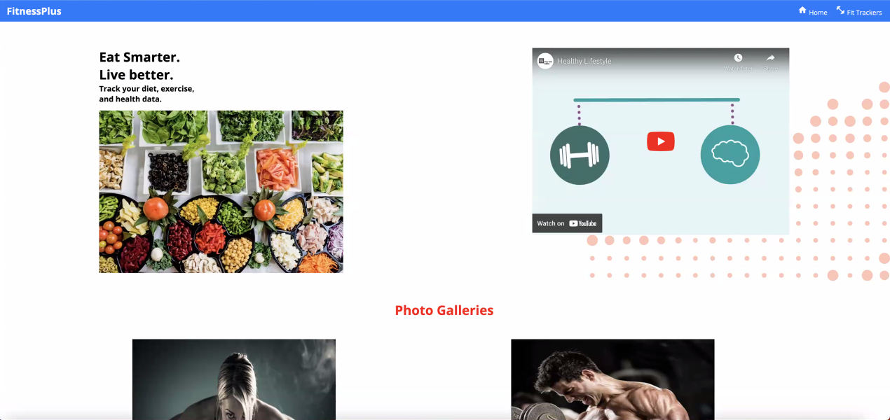
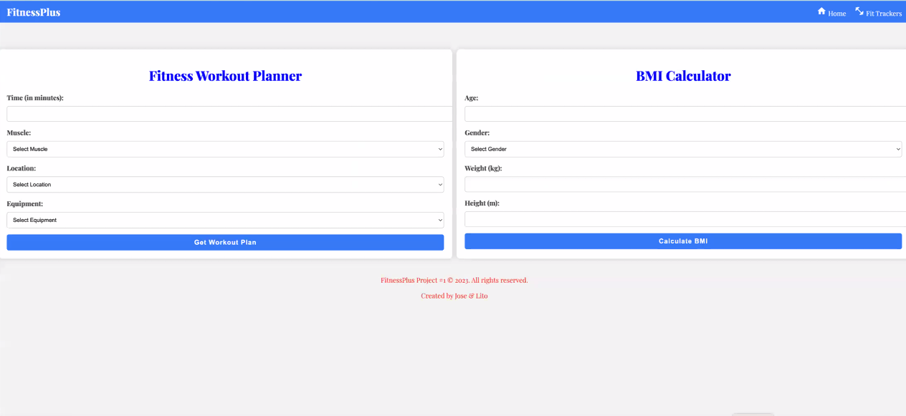
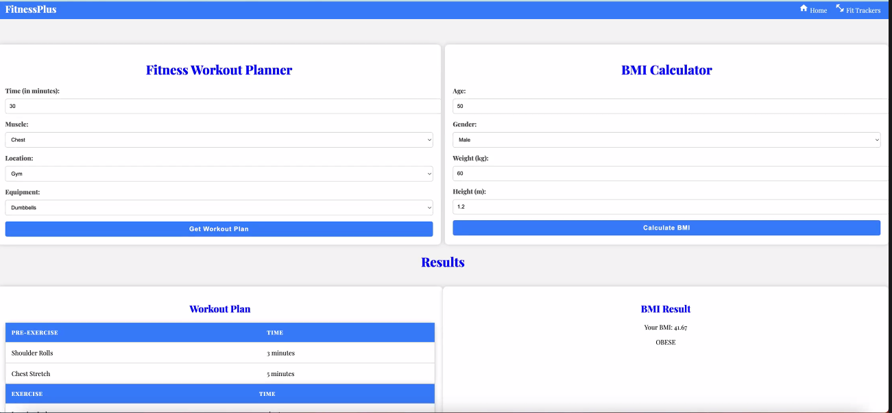

# Fitness Plus
Welcome to Fitness Plus! This app provides a BMI calculator and a fitness workout plan via API. Stay fit and healthy with our personalized workout plans and track your BMI easily.
## Table of Contents
- [Introduction](#introduction)
- [Features](#features)
- [Screenshots](#screenshots)
- [Demo](#demo)
- [Installation](#installation)
- [Usage](#usage)
- [Contributors](#contributors)
## Introduction
Fitness Plus is a fitness application that helps you stay on track with your fitness goals. It offers a BMI calculator to check your body mass index, and a workout plan that is customized based on your personal preferences and fitness level, thanks to our fitness API.
## Features
- **BMI Calculator:** Easily calculate your Body Mass Index using our intuitive BMI calculator. Just input your height and weight, and it will provide your BMI and indicate if you are underweight, normal weight, overweight, or obese.
- **Fitness Workout Plan via API:** Our app offers a wide range of workout plans through the integration of a fitness API. Users can select their preferred workout types, duration, and intensity level to receive a personalized fitness plan.
## Screenshots

## Demo
Check out the live demo of the Fitness Plus app [here](https://hyperlitz.github.io/fitnessplus/).
## Repository
Repository link [here](https://github.com/hyperlitz/fitnessplus).
## Installation
To run the Fitness Plus app locally, follow these steps:
1. Clone the repository from GitHub:
https://github.com/hyperlitz/fitnessplus.git
2. Navigate to the project directory:
cd fitness-plus
then run on live-server
## Usage
- **BMI Calculator:** Simply navigate to the BMI calculator section on the app, enter your height and weight, and click the "Calculate" button to get your BMI.
- **Fitness Workout Plan:** Go to the fitness workout plan section, and you'll be prompted to choose your workout preferences, such as workout type, duration, and intensity. After selecting your preferences, click the "Generate Plan" button, and your personalized workout plan will be displayed.
## Contributors
This project was developed by:
- [Lolito](https://github.com/hyperlitz) - Team Leader/Project Lead
- [Andretta](https://github.com/andrettaj) - Developer
- [Jose](https://github.com/venomgto) - Developer
We welcome contributions from the community to make Fitness Plus even better! If you find any issues or have suggestions for improvements, feel free to create a pull request or submit an issue on the GitHub repository.
Happy fitness journey with Fitness Plus!
Please note that the Screenshots section should have direct links to the actual screenshots of your app, and the Demo section should have a link to the live demo of your Fitness Plus app. Additionally, make sure to replace link_to_screenshot_X and link_to_live_demo with the appropriate URLs.
GitHubGitHub
GitHub - hyperlitz/fitnessplus
Contribute to hyperlitz/fitnessplus development by creating an account on GitHub. (33 kB)
https://github.com/hyperlitz/fitnessplus

GitHubGitHub
GitHub - hyperlitz/fitnessplus
Contribute to hyperlitz/fitnessplus development by creating an account on GitHub. (33 kB)
https://github.com/hyperlitz/fitnessplus.git

GitHubGitHub
hyperlitz - Overview
hyperlitz has 8 repositories available. Follow their code on GitHub.
GitHubGitHub
andrettaj - Overview
andrettaj has 15 repositories available. Follow their code on GitHub.